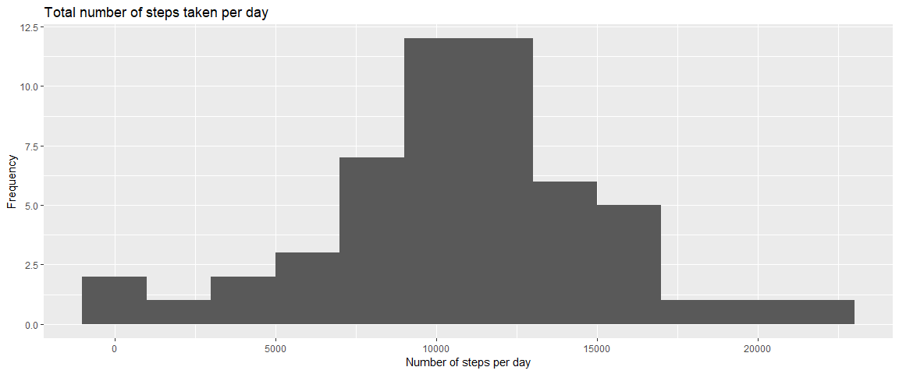
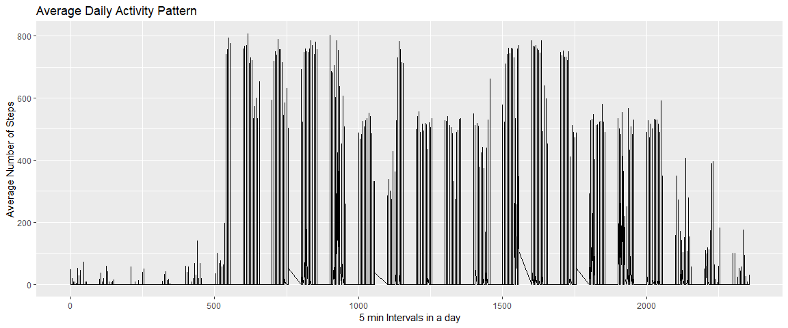
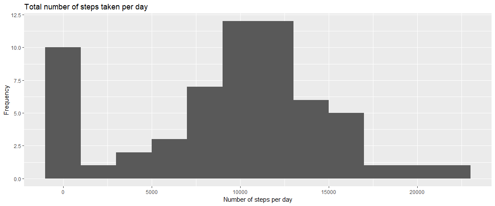
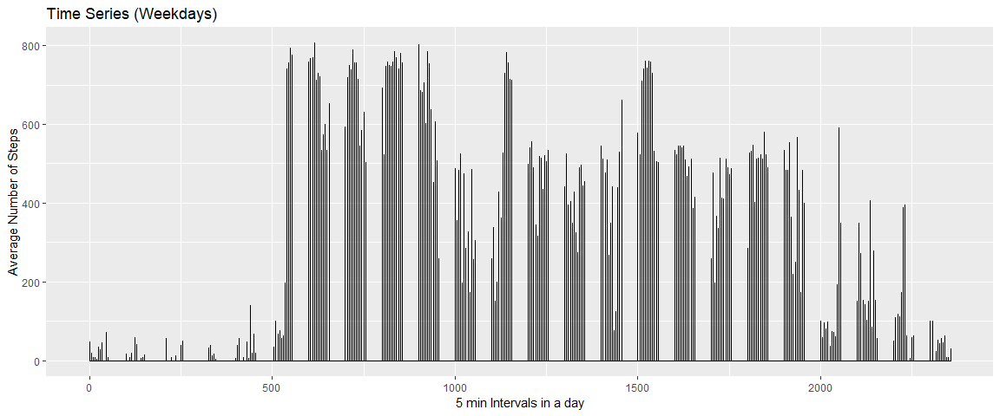
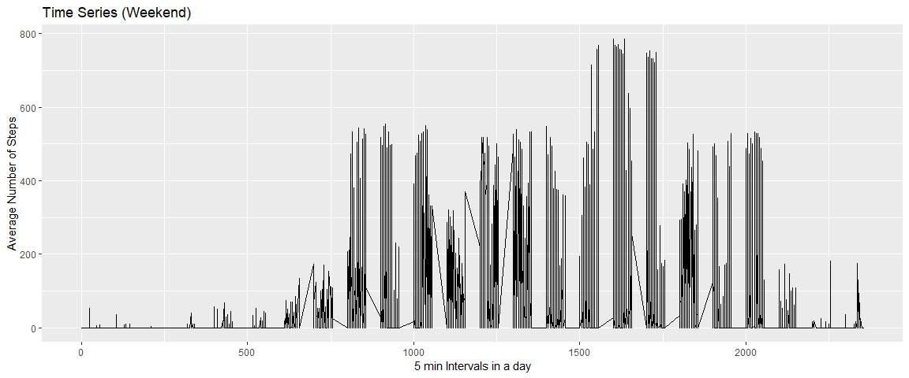

## Loading and preprocessing the data
First, we load some libraries, then download and load the file into memory and filter the missing values

```r
library('dplyr')
```

```
## 
## Attaching package: 'dplyr'
```

```
## The following objects are masked from 'package:stats':
## 
##     filter, lag
```

```
## The following objects are masked from 'package:base':
## 
##     intersect, setdiff, setequal, union
```

```r
library('ggplot2')
```

```
## Registered S3 methods overwritten by 'ggplot2':
##   method         from 
##   [.quosures     rlang
##   c.quosures     rlang
##   print.quosures rlang
```

```r
library('timeDate')

if(!file.exists('repdata_Fdata_Factivity.zip')){
  download.file(url='https://d396qusza40orc.cloudfront.net/repdata%2Fdata%2Factivity.zip', 
                destfile = 'repdata_Fdata_Factivity.zip')
}
if(!file.exists('activity.csv')){
  unzip(zipfile = 'repdata_Fdata_Factivity.zip')
}

raw_data<- read.table(file='activity.csv', sep=',', header=TRUE, stringsAsFactors = FALSE, na.strings = 'NA')

raw_data<- mutate(raw_data, date= as.Date( raw_data$date) )

data<-raw_data[ complete.cases(raw_data), ]
```

## What is mean total number of steps taken per day?
First we group by date and then summarize the total, median and mean per day. Then we plot the histogram

```r
stepsTakenPerDay<- data %>% 
                    group_by(date) %>% 
                    summarize( total=sum(steps), median=median(steps), mean=mean(steps) ) %>% 
                    arrange( date )

ggplot(data=stepsTakenPerDay, aes(x=total)) + 
    geom_histogram(binwidth = 2000) + 
    ggtitle('Total number of steps taken per day')+
    xlab("Number of steps per day") +
    ylab("Frequency")
```

<!-- -->

Then we show the median and mean for the total number of steps taken per day

```r
print(stepsTakenPerDay[, c('date','median', 'mean')], n=100)
```

```
## # A tibble: 53 x 3
##    date       median   mean
##    <date>      <dbl>  <dbl>
##  1 2012-10-02      0  0.438
##  2 2012-10-03      0 39.4  
##  3 2012-10-04      0 42.1  
##  4 2012-10-05      0 46.2  
##  5 2012-10-06      0 53.5  
##  6 2012-10-07      0 38.2  
##  7 2012-10-09      0 44.5  
##  8 2012-10-10      0 34.4  
##  9 2012-10-11      0 35.8  
## 10 2012-10-12      0 60.4  
## 11 2012-10-13      0 43.1  
## 12 2012-10-14      0 52.4  
## 13 2012-10-15      0 35.2  
## 14 2012-10-16      0 52.4  
## 15 2012-10-17      0 46.7  
## 16 2012-10-18      0 34.9  
## 17 2012-10-19      0 41.1  
## 18 2012-10-20      0 36.1  
## 19 2012-10-21      0 30.6  
## 20 2012-10-22      0 46.7  
## 21 2012-10-23      0 31.0  
## 22 2012-10-24      0 29.0  
## 23 2012-10-25      0  8.65 
## 24 2012-10-26      0 23.5  
## 25 2012-10-27      0 35.1  
## 26 2012-10-28      0 39.8  
## 27 2012-10-29      0 17.4  
## 28 2012-10-30      0 34.1  
## 29 2012-10-31      0 53.5  
## 30 2012-11-02      0 36.8  
## 31 2012-11-03      0 36.7  
## 32 2012-11-05      0 36.2  
## 33 2012-11-06      0 28.9  
## 34 2012-11-07      0 44.7  
## 35 2012-11-08      0 11.2  
## 36 2012-11-11      0 43.8  
## 37 2012-11-12      0 37.4  
## 38 2012-11-13      0 25.5  
## 39 2012-11-15      0  0.142
## 40 2012-11-16      0 18.9  
## 41 2012-11-17      0 49.8  
## 42 2012-11-18      0 52.5  
## 43 2012-11-19      0 30.7  
## 44 2012-11-20      0 15.5  
## 45 2012-11-21      0 44.4  
## 46 2012-11-22      0 70.9  
## 47 2012-11-23      0 73.6  
## 48 2012-11-24      0 50.3  
## 49 2012-11-25      0 41.1  
## 50 2012-11-26      0 38.8  
## 51 2012-11-27      0 47.4  
## 52 2012-11-28      0 35.4  
## 53 2012-11-29      0 24.5
```

## What is the average daily activity pattern?
In order to answer this question, we need to plot a time series of the 5-minute interval(x-axis) and the average number of steps taken, averaged across all days (y-axis)

```r
stepsTakenPerDayPerInterval<- data %>% 
                              group_by(date, interval) %>% 
                              summarize( total=sum(steps), median=median(steps), mean=mean(steps) ) %>% 
                              arrange( date, interval )

ggplot(data=stepsTakenPerDayPerInterval, aes(x=interval, y=mean)) + 
    geom_line() + 
    ggtitle('Average Daily Activity Pattern')+
    xlab("5 min Intervals in a day") +
    ylab("Average Number of Steps")
```

<!-- -->

Which 5-minute interval, on average across all the days in the dataset, contains the maximum number of steps?

```r
stepsTakenPerDayPerInterval[ which.max(as.data.frame(stepsTakenPerDayPerInterval)[, 'total']), ] 
```

```
## # A tibble: 1 x 5
## # Groups:   date [1]
##   date       interval total median  mean
##   <date>        <int> <int>  <int> <dbl>
## 1 2012-11-27      615   806    806   806
```

This means that in 2012-11-27 at the [6:15-6:20] interval, the average number of steps is 806

## Imputing missing values
First we calculate the total number of missing values in the dataset

```r
sum(is.na(raw_data$steps))
```

```
## [1] 2304
```

We interpolated the NA values by taking the mean number of steps taken per day per interval. We create a new dataset that is equal to the original dataset but with the missing data filled in

```r
fixed_data <- raw_data
for (i in 1:nrow(raw_data)) {
    if (is.na(raw_data[i,'steps'] ) ) {
        data_to_replace <- raw_data[i, c('date','interval')]
        if( stepsTakenPerDayPerInterval$date == data_to_replace$date && 
            stepsTakenPerDayPerInterval$interval == data_to_replace$interval){
                steps_new <- subset(stepsTakenPerDayPerInterval, 
                                    date == data_to_replace$date &&
                                    interval == data_to_replace$interval)$mean
                fixed_data[i,'steps'] <- steps_new
        }
        else{
          fixed_data[i,'steps'] <- 0
        }
    }        
}
```

Now, let's plot a histogram of the total number of steps taken each day and print the median and mean of steps taken by date

```r
fixed_group_data<- fixed_data %>% 
              group_by(date) %>% 
              summarize( total=sum(steps), median=median(steps), mean=mean(steps) ) %>% 
              arrange( date )

ggplot(data=fixed_group_data, aes(x=total)) + 
    geom_histogram(binwidth = 2000) + 
    ggtitle('Total number of steps taken per day')+
    xlab("Number of steps per day") +
    ylab("Frequency")
```

<!-- -->

```r
print(fixed_group_data[, c('date','median', 'mean')], n=100)
```

```
## # A tibble: 61 x 3
##    date       median   mean
##    <date>      <dbl>  <dbl>
##  1 2012-10-01      0  0    
##  2 2012-10-02      0  0.438
##  3 2012-10-03      0 39.4  
##  4 2012-10-04      0 42.1  
##  5 2012-10-05      0 46.2  
##  6 2012-10-06      0 53.5  
##  7 2012-10-07      0 38.2  
##  8 2012-10-08      0  0    
##  9 2012-10-09      0 44.5  
## 10 2012-10-10      0 34.4  
## 11 2012-10-11      0 35.8  
## 12 2012-10-12      0 60.4  
## 13 2012-10-13      0 43.1  
## 14 2012-10-14      0 52.4  
## 15 2012-10-15      0 35.2  
## 16 2012-10-16      0 52.4  
## 17 2012-10-17      0 46.7  
## 18 2012-10-18      0 34.9  
## 19 2012-10-19      0 41.1  
## 20 2012-10-20      0 36.1  
## 21 2012-10-21      0 30.6  
## 22 2012-10-22      0 46.7  
## 23 2012-10-23      0 31.0  
## 24 2012-10-24      0 29.0  
## 25 2012-10-25      0  8.65 
## 26 2012-10-26      0 23.5  
## 27 2012-10-27      0 35.1  
## 28 2012-10-28      0 39.8  
## 29 2012-10-29      0 17.4  
## 30 2012-10-30      0 34.1  
## 31 2012-10-31      0 53.5  
## 32 2012-11-01      0  0    
## 33 2012-11-02      0 36.8  
## 34 2012-11-03      0 36.7  
## 35 2012-11-04      0  0    
## 36 2012-11-05      0 36.2  
## 37 2012-11-06      0 28.9  
## 38 2012-11-07      0 44.7  
## 39 2012-11-08      0 11.2  
## 40 2012-11-09      0  0    
## 41 2012-11-10      0  0    
## 42 2012-11-11      0 43.8  
## 43 2012-11-12      0 37.4  
## 44 2012-11-13      0 25.5  
## 45 2012-11-14      0  0    
## 46 2012-11-15      0  0.142
## 47 2012-11-16      0 18.9  
## 48 2012-11-17      0 49.8  
## 49 2012-11-18      0 52.5  
## 50 2012-11-19      0 30.7  
## 51 2012-11-20      0 15.5  
## 52 2012-11-21      0 44.4  
## 53 2012-11-22      0 70.9  
## 54 2012-11-23      0 73.6  
## 55 2012-11-24      0 50.3  
## 56 2012-11-25      0 41.1  
## 57 2012-11-26      0 38.8  
## 58 2012-11-27      0 47.4  
## 59 2012-11-28      0 35.4  
## 60 2012-11-29      0 24.5  
## 61 2012-11-30      0  0
```

## Are there differences in activity patterns between weekdays and weekends?
Looks like people get up more early in weekdays

```r
fixed_group_data2<- fixed_data %>% 
              group_by(date, interval) %>% 
              summarize( total=sum(steps), median=median(steps), mean=mean(steps) ) %>% 
              arrange( date, interval )

fixed_group_data2 <- cbind( as.data.frame(fixed_group_data2), 
                            as.factor(isWeekday( fixed_group_data2$date)), 
                            as.factor(isWeekend( fixed_group_data2$date) )
                          )

names(fixed_group_data2) <- c('date','interval','total','median','mean','isWeekday','isWeekend')

ggplot(data=subset(fixed_group_data2, isWeekday=='TRUE'), aes(x=interval, y=mean)) + 
    geom_line() + 
    ggtitle('Time Series (Weekdays)')+
    xlab("5 min Intervals in a day") +
    ylab("Average Number of Steps")
```

<!-- -->

```r
ggplot(data=subset(fixed_group_data2, isWeekend=='TRUE'), aes(x=interval, y=mean)) + 
    geom_line() + 
    ggtitle('Time Series (Weekend)')+
    xlab("5 min Intervals in a day") +
    ylab("Average Number of Steps")
```

<!-- -->
